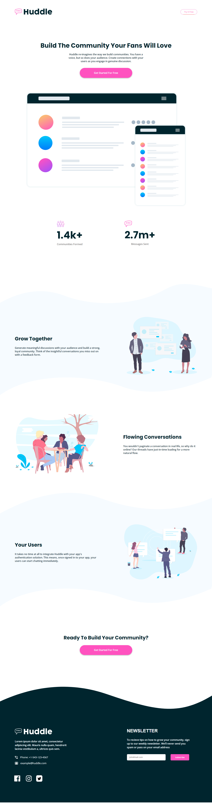

# Frontend Mentor - Huddle landing page with curved sections solution

This is a solution to the [Huddle landing page with curved sections challenge on Frontend Mentor](https://www.frontendmentor.io/challenges/huddle-landing-page-with-curved-sections-5ca5ecd01e82137ec91a50f2). Frontend Mentor challenges help you improve your coding skills by building realistic projects. 

## Table of contents
  - [Built with](Vanila CSS)
  - [What I learned](#About landing page)
  - [Continued development](#continued-development)
  - [Useful resources](#w3schools)
- [Author](#Arzu475)
- [Acknowledgments](#acknowledgments)


## Overview

### The challenge

Users should be able to:

- View the optimal layout for the site depending on their device's screen size
- See hover states for all interactive elements on the page

### Screenshot




### Links

- Solution URL: [Add solution URL here](https://your-solution-url.com)
- Live Site URL: [Add live site URL here](https://your-live-site-url.com)

## My process

### Built with

- Semantic HTML5 markup
- CSS custom properties
- Flexbox
- Vanilla CSS


### What I learned

I learned about landing page for advance. I'm very glad for done this challenge.

```html
<h1>Some HTML code I'm proud of</h1>
```

## Author

- Website - [Add your name here](https://www.your-site.com)
- Frontend Mentor - [@Arzu475](https://www.frontendmentor.io/profile/yourusername)
- Twitter - [@AkhundZuu](https://www.twitter.com/Akhund_Zuu)

